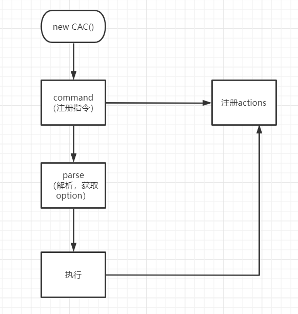

**目录分析**

```
│  .editorconfig   //跨编辑器的代码风格及样式规范化
│  .gitattributes  //每当有文件保存或者创建时,git 会根据文件内指定的属性来自动地保存。
├─examples  //使用示例
├─scripts  //构建脚本
└─src

    └─__test__           //测试代码存放目录
        └─__snapshots__
                index.test.ts.snap
```

- Q:目录中一般会有几个文件夹

- - script：构建脚本
  - __test__：放单测文件a
  - examples：库的使用示例
  - src：主目录

- **editorconfig文件**

- 跨编辑器的代码风格及样式规范化文件

- **.gitattributes文件**

- 当执行 git 动作时，.gitattributes 文件允许你指定由 git 使用的文件和路径的属性。

- 每当有文件保存或者创建时,git 会根据文件内指定的属性来自动地保存。最典型的例子就是每个文件的行结尾endOfLine 配置。

- **单元测试环境是如何搭建的**

- - Q：ts-test的作用

  - - 安装后可直接使用jest测试ts代码

  - Q：如果没有 ts-jest 的话，你会搭建基于 ts 的 jest 的环境嘛？

  - - 使用babel应该可以

- **如何实现连续调用的api**

- CAC是一个类，它的函数在调用的时候都会return this 以此来实现链式调用

- **画一下这个库的程序流程图**

- 

- **如何理解 command**

- - 在程序里面是如何实现的

  - - 构造一个Command实例，解析rawName，去除括号并且挂载到name中，然后将rawName中的括号挂载到args中。

- **如何理解 action**

- - action是做什么的

  - - 当前指令所对应的回调函数

  - 在程序里面是如何实现的

  - - 在注册command的时候，会把当前command对应的回调函数收集起来挂到Command上，当执行了命令之后，如果当前的command有注册回调函数，那么就会依次调用。